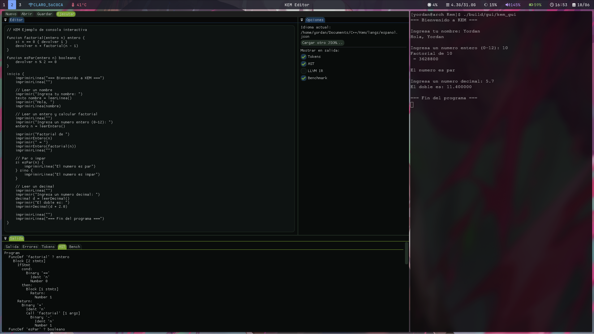

[](https://hub.docker.com/r/vyordan/kem)
[](https://hub.docker.com/r/vyordan/kem)

<div align="center">
  
  
  **Un Lenguaje que habla tu Idioma**
</div>

# Lenguaje de Programación / Compilador JIT (C++/LLVM)

**Kem** (*"tejer"* en el idioma K'iche') es un lenguaje de programación de sintaxis sencilla diseñado originalmente en español, que se ejecuta de forma nativa a través de su propio compilador JIT (Just-In-Time).

El proyecto es un ecosistema integrado que unifica un lenguaje accesible con una infraestructura de bajo nivel basada en **LLVM**, utiliza **C++** para el pasar del Codigo fuente (codigo KEM) a LLVM IR.

* **Compilación JIT Nativa:** Toma el código fuente y lo compila directamente a código de máquina al vuelo vía LLVM, garantizando una ejecución rápida.
* **Modularidad Lingüística Absoluta:** Aunque la sintaxis por defecto es en español, el idioma de las palabras clave es 100% configurable mediante un archivo JSON externo. Esto permite reutilizar el mismo compilador para mapear el lenguaje a cualquier idioma natural o variante maya (como el Kaqchikel o K'iche').

---
[Documentacion](doc/kem_documentacion.md) - En la carpeta doc se encuentra documentacion mas detallada y completa, este README es una presentacion rapida de lo que es el proyecto. 
---

## Requisitos

```bash
# Arch Linux
sudo pacman -S llvm lld cmake ninja git
```

Versión mínima de LLVM: **17**. Probado con LLVM 22.

---

## Compilar

```bash
git clone https://github.com/vyordan/kem
cd kem

cmake -B build -G Ninja -DCMAKE_BUILD_TYPE=Release
cmake --build build

# Verificar que funciona
./build/cli/kem --help
```


## Uso por terminal (CLI)

```bash
# Ejecutar un programa KEM
./build/cli/kem programa.kem

# Usar otro idioma
./build/cli/kem --lang=langs/english.json programa.kem

# Ver el LLVM IR generado
./build/cli/kem --emit-ir programa.kem

# Ver el AST
./build/cli/kem --emit-ast programa.kem

# Ver los tokens
./build/cli/kem --emit-tokens programa.kem

# Medir tiempos de cada fase
./build/cli/kem --benchmark programa.kem
```

---

## Docker

```bash
# Construir la imagen
docker build -t kem .

# Ejecutar un programa
docker run --rm -v $(pwd)/mi_programa.kem:/programa.kem kem /programa.kem

# Ver el IR generado
docker run --rm -v $(pwd)/mi_programa.kem:/programa.kem kem --emit-ir /programa.kem
```

---

## Editor gráfico KEM (GUI)



La carpeta `gui/` contiene un editor de código integrado para programas KEM, construido con GLFW, ImGui (rama docking) y OpenGL.

NOTA: Por el momento tiene lo basico para funcionar, se espera primerto terminar de refinar el compilador para luego proceder con el desarrollo del IDE.

**Características principales:**
- Ejecución del pipeline KEM directamente desde la GUI, sin guardar en disco.
- Captura opcional de la salida en un panel interno o visualización en la terminal original.
- Opción de lanzar el programa en una terminal externa para interacción completa (stdin/stdout).
- Paneles redimensionables y reorganizables mediante docking.

**Ejecución:**
```bash
./build/gui/kem_gui
```

## Ejemplo de programa KEM

```
funcion fibonacci(entero n) entero {
    si n < 2 {
        devolver n
    }
    devolver fibonacci(n - 1) + fibonacci(n - 2)
}

inicio {
    entero resultado = fibonacci(10)
}
```

---

## El sistema multi-idioma

KEM soporta cualquier idioma humano mediante archivos JSON en `langs/`.
Cada archivo mapea las palabras clave del idioma al `TokenType` interno del compilador.

```json
{
  "funcion":    "KW_FUNCION",
  "si":         "KW_SI",
  "devolver":   "KW_DEVOLVER",
  "entero":     "KW_ENTERO"
}
```

El mismo programa escrito en inglés:

```json
{
  "function":   "KW_FUNCION",
  "if":         "KW_SI",
  "return":     "KW_DEVOLVER",
  "int":        "KW_ENTERO"
}
```

```bash
./kem --lang=langs/english.json programa.kem
```

---

## Referencia del lenguaje

### Tipos de datos

| KEM       | LLVM IR  | Descripción          |
|-----------|----------|----------------------|
| `entero`  | `i64`    | Entero de 64 bits    |
| `decimal` | `double` | Punto flotante 64b   |
| `texto`   | `i8*`    | Cadena de caracteres |
| `booleano`| `i1`     | Verdadero o falso    |

### Funciones y procedimientos

```
funcion nombre(tipo param) tipo_retorno {
    devolver valor
}

procedimiento nombre(tipo param) {
    // no retorna valor
}
```

### Flujo de control

```
si condicion {
    // ...
} sino si otra_condicion {
    // ...
} sino {
    // ...
}

mientras condicion {
    // ...
}

// Bucle con rango (var debe estar declarada antes)
entero i
i = 0 hasta 10 {
    // i va de 0 a 9
}

i = 0 hasta 100 paso 5 {
    // i: 0, 5, 10, 15, ...
}
```

### Arreglos

```
entero nums[5] = [10, 20, 30, 40, 50]
entero x = nums[2]   // 30
nums[0] = 99
```

### Estructuras

```
estructura Punto {
    decimal x
    decimal y
}

Punto p
p.x = 1.0
p.y = 2.0
```

### Salida

```
imprimir(texto)          // imprime el texto sin salto de linea al final
imprimirLinea(texto)     // imprime el texto con salto de linea al final
imprimirEntero(entero)   // imprime un entero en formato decimal
imprimirDecimal(decimal) // imprime un decimal con 6 cifras decimales
```

**Ejemplos:**

```
inicio {
    imprimir("Hola, ")
    imprimirLinea("mundo!")          // salida: Hola, mundo!

    imprimirEntero(42)               // salida: 42
    imprimirEntero(-7)               // salida: -7

    imprimirDecimal(3.14159)         // salida: 3.141590
    imprimirDecimal(2.0)             // salida: 2.000000

    imprimir("resultado = ")
    imprimirEntero(3 + 4 * 2)        // salida: resultado = 11
}
```

Se pueden combinar para formatear salida compleja

### Entrada

```
leerLinea()   → texto    // lee una linea completa de stdin
leerEntero()  → entero   // lee un numero entero de stdin
leerDecimal() → decimal  // lee un numero decimal de stdin
```

**Ejemplos:**

```
inicio {
    imprimir("Ingresa tu nombre: ")
    texto nombre = leerLinea()
    imprimir("Hola, ")
    imprimirLinea(nombre)

    imprimir("Ingresa un numero: ")
    entero n = leerEntero()
    imprimir("El doble es: ")
    imprimirEntero(n * 2)
    imprimirLinea("")

    imprimir("Ingresa un decimal: ")
    decimal d = leerDecimal()
    imprimirDecimal(d * d)
}
```

### Interoperabilidad con C

```
enlazar vacio printf(texto)
enlazar entero strlen(texto)

inicio {
    printf("Hola desde KEM!\n")
}
```

### Comentarios

```
// Comentario de línea
/* Comentario
   de bloque */
comentario Esto también es un comentario
comentario{ Y esto
            también }
```

---

## Correr los tests

```bash
cd build
ctest --output-on-failure

# O correr cada suite individualmente
./tests/lexer/kem_test_lexer
./tests/parser/kem_test_parser
./tests/semantic/kem_test_semantic
./tests/codegen/kem_test_codegen
./tests/integration/kem_test_integration
```

---

## Arquitectura del compilador

```
archivo.kem
    │
    ▼
LangConfig ──── langs/espanol.json
    │
    ▼
Lexer ──────────── vector<Token>
    │
    ▼
Parser ─────────── unique_ptr<Program>  (AST)
    │
    ▼
SemanticAnalyzer ── AST anotado + tabla de símbolos
    │
    ▼
IRGenerator ────── llvm::Module
    │
    ▼
ORC JIT ─────────── código nativo x86-64
    │
    ▼
Ejecución
```
## Árbol completo

```
kem/
├── CMakeLists.txt                  ← build raíz, ensambla todos los sub-targets
├── README.md
├── Dockerfile
├── .gitignore
│
├── include/
│   └── kem/
│       ├── LangConfig.hpp          ← carga el JSON de idioma, resuelve keywords → TokenType
│       ├── Token.hpp               ← struct Token + enum TokenType (sin lógica, solo datos)
│       ├── Lexer.hpp               ← tokenizador
│       ├── AST.hpp                 ← todos los nodos del AST + interfaz Visitor
│       ├── Parser.hpp              ← recursive descent + Pratt
│       ├── SemanticAnalyzer.hpp    ← Visitor: verifica tipos y scopes
│       ├── IRGenerator.hpp         ← Visitor: AST → LLVM IR
│       ├── JITEngine.hpp           ← wrapper del ORC JIT
│       └── ErrorHandler.hpp        ← errores con línea, columna y mensaje localizable
│
├── src/
│   ├── LangConfig.cpp
│   ├── Lexer.cpp
│   ├── AST.cpp                     ← implementación de métodos de los nodos (si los hay)
│   ├── Parser.cpp
│   ├── SemanticAnalyzer.cpp
│   ├── IRGenerator.cpp
│   └── JITEngine.cpp
│   └── ErrorHandler.cpp
│
├── cli/
│   ├── CMakeLists.txt              ← target ejecutable: kem
│   └── main.cpp                    ← parsea args, carga LangConfig, corre el pipeline
│
├── langs/                          ← archivos de idioma intercambiables
│   ├── espanol.json                ← idioma por defecto
│   └── english.json                ← demostración del sistema multi-idioma
│
├── examples/                       ← programas KEM de ejemplo (también usados en tests)
│   ├── hola.kem
│   ├── fibonacci.kem
│   ├── factorial.kem
│   ├── arreglos.kem
│   └── estructuras.kem
│
├── tests/
│   ├── CMakeLists.txt
│   ├── lexer/
│   │   ├── test_tokens.cpp         ← tokeniza strings conocidos, verifica output
│   │   └── test_comentarios.cpp
│   ├── parser/
│   │   ├── test_expresiones.cpp
│   │   ├── test_funciones.cpp
│   │   └── test_flujo.cpp
│   ├── semantic/
│   │   ├── test_tipos.cpp          ← errores semánticos esperados
│   │   └── test_scopes.cpp
│   ├── codegen/
│   │   └── test_ir.cpp             ← verifica que el IR generado sea válido
│   └── integration/
│       └── test_ejemplos.cpp       ← compila y ejecuta examples/*.kem, verifica resultado

```

---


### Módulos

| Archivo                  | Responsabilidad                              |
|--------------------------|----------------------------------------------|
| `LangConfig`             | Carga el JSON de idioma                      |
| `Lexer`                  | Texto → lista de tokens                      |
| `AST`                    | Nodos del árbol sintáctico + Visitor         |
| `Parser`                 | Tokens → AST (Recursive Descent + Pratt)     |
| `SemanticAnalyzer`       | Verificación de tipos y scopes               |
| `IRGenerator`            | AST → LLVM IR vía IRBuilder                  |
| `JITEngine`              | IR → código nativo + ejecución (ORC JIT)     |
| `ErrorHandler`           | Mensajes de error uniformes con línea/col    |

---

## Agregar un nuevo idioma

1. Copiar `langs/espanol.json` con el nuevo nombre
2. Reemplazar las palabras clave por las del idioma objetivo
3. Ejecutar: `./kem --lang=langs/mi_idioma.json programa.kem`

El compilador valida que el archivo contenga todas las keywords
obligatorias al arrancar y lanza un error descriptivo si falta alguna.
